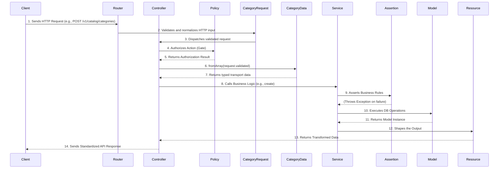

# Feature Showcase: The Category CRUD Module

This document provides a deep dive into the architecture and implementation of the Category management module. Far from being a simple CRUD, this feature is a comprehensive demonstration of the project's core principles: clean architecture, testability, and robust business logic handling. It serves as a prime example of how to build a scalable and maintainable feature within this API boilerplate.

The main purpose of the Category module is to organize products in a hierarchical structure (e.g., "Electronics" -> "Laptops" -> "Gaming Laptops").

## 1. Architectural Overview

The architecture is designed to be clean, layered, and highly cohesive. Each class has a single, well-defined responsibility, making the system easy to understand, test, and extend.

A typical request flows through the following layers:

## 2. Component Breakdown

Let's explore the role of each key component in the `app-modules/catalog` module.

### The Model (`Category.php`): The Hierarchical Core

The `Lahatre\Catalog\Models\Category` model is more than just a data container; it's the heart of our hierarchical data management.

-   **Hierarchical Structure:** It uses the [`staudenmeir/laravel-adjacency-list`](https://github.com/staudenmeir/laravel-adjacency-list) package via the `HasRecursiveRelationships` trait. This powerful addition provides out-of-the-box methods for handling tree structures, such as `ancestors()`, `descendants()`, `siblings()`, and `bloodline()` (ancestors + descendants + self). This avoids complex recursive queries in the application code.
-   **Conventions:** It strictly follows the project's [model conventions](./../database/models.md), including the use of UUIDs (`SharedTraits`), explicit table name, `$fillable` attributes, and comprehensive property `$casts` (especially `immutable_datetime`).

### The Service (`CategoryService.php`): The Business Logic Orchestrator

The `Lahatre\Catalog\Services\CategoryService` encapsulates all the core business logic for categories.

-   **Responsibilities:** It handles the logic for creating, updating, retrieving, listing, and deleting categories.
-   **Handle Generation:** On creation, it uses a shared `HandleGenerator` utility to create a unique, URL-friendly `handle` from the category name, ensuring consistency across different models.
-   **Database Integrity:** All write operations (`create`, `update`, `delete`) are wrapped in `DB::transaction()`, guaranteeing that the operation is atomic and the database remains in a consistent state.
-   **Dependency Injection:** It injects other components like `CategoryAssertion`, demonstrating a clean separation of concerns.

### Assertions (`CategoryAssertion.php`): Encapsulated Business Rules

This is a cornerstone of our error-handling strategy, as described in the [API Responses & Error Handling documentation](./../api/responses-and-errors.md).

-   **Purpose:** The `Lahatre\Catalog\Assertions\CategoryAssertion` class isolates complex business rules from the service layer.
-   **Examples:**
    -   `assertCanDelete(Category $category)`: Checks if a category has children and throws a `CategoryHasChildrenException` if it does.
    -   `assertCanBeNewParent(Category $category, ?string $newParentId)`: Prevents a category from being assigned to itself or one of its own descendants, throwing a `CategoryCannotBeDescendantParentException`.
-   **Benefit:** This pattern keeps the service layer clean and focused on the "happy path", while centralizing business rule validation in dedicated, testable classes.

### Form Requests and Data (`CategoryRequest`, `CategoryData`, `CategoryFilterData`)

The HTTP and service contracts are deliberately separated, as detailed in the [Form Requests and Data documentation](./../data/form-requests-and-data.md).

-   **`CategoryRequest`:** Validates and normalizes the `POST` and `PUT/PATCH` HTTP payloads. Route-model context is used for update-specific rules.
-   **`CategoryData`:** Maps validated `snake_case` keys to immutable `camelCase` properties. `MissingValue` distinguishes an absent update field from an explicit `null`.
-   **`CategoryFilterRequest` and `CategoryFilterData`:** Validate query parameters, then transport typed filters and pagination defaults to the service.

### The Controller (`CategoryController.php`): The HTTP Layer

The `Lahatre\Catalog\Http\Controllers\CategoryController` is intentionally "thin." Its sole responsibility is to handle the HTTP layer.

-   **Orchestration:** It receives the validated Form Request, authorizes the action using the `CategoryPolicy`, builds the appropriate Data object, calls the `CategoryService`, and formats the output using the `CategoryResource`.
-   **Separation of Concerns:** It contains no business logic. All logic is delegated to other layers, making the controller easy to read and maintain.

### API Resource (`CategoryResource.php`): The Presentation Layer

The `Lahatre\Catalog\Http\Resources\CategoryResource` is responsible for transforming the `Category` model into the final JSON representation.

-   **Selective Loading:** It uses `whenLoaded()` to conditionally include relationships, preventing N+1 problems.
-   **Data Transformation:** A key feature is the transformation of the `bloodline` relationship. The `buildTree()` method efficiently converts the flat list of ancestors and descendants into a nested tree structure, which is much easier for a frontend client to consume and render.

### Policy (`CategoryPolicy.php`): The Security Gatekeeper

Security is handled by `Lahatre\Catalog\Policies\CategoryPolicy`.

-   **Permission-Based:** It uses the project's permission system (Spatie Permissions) to check if the authenticated user has the required permission (e.g., `categories.create`, `categories.update`). This aligns with the conventions defined in the [Permissions documentation](./../iam/permissions.md).
-   **Integration:** It is automatically registered and used by the `Gate` facade in the controller.

## 3. Ensuring Hierarchical Integrity: Beyond a Simple CRUD

What truly elevates the Category module beyond a standard CRUD is its robust handling of the hierarchical data structure. Without careful validation, it would be possible to create impossible scenarios, such as making a category a child of its own descendant, leading to infinite loops and data corruption.

This is where the `CategoryAssertion` service plays a critical role:

-   **Preventing Circular Dependencies:** The `assertCanBeNewParent()` method is called before any update. It meticulously checks that the new proposed parent is not the category itself or any of its existing children (descendants). This check is crucial for preventing circular references in the category tree.

-   **Safe Deletion:** The `assertCanDelete()` method ensures that a category with existing children cannot be deleted. This prevents orphaned records and forces the API user to make a conscious decision about what to do with the child categories first (either reassign or delete them).

These assertions, combined with custom, translatable exceptions (`CategoryCannotBeDescendantParentException`, `CategoryHasChildrenException`), provide clear and actionable feedback to the client while guaranteeing the integrity and consistency of the database at all times. This proactive validation is a hallmark of a robust, production-ready system.

## 4. Database & Seeding

-   **Migration:** The `create_all_catalog_tables.php` migration defines the schema for `catalog_categories`, including the self-referencing `parent_id` foreign key.
-   **Seeder:** The `CategorySeeder.php` provides a set of sample data, including nested categories. This is invaluable for development, testing, and demonstrating the hierarchical functionality.

## 5. Conclusion

The Category CRUD module is a testament to the project's architectural philosophy. By leveraging distinct layers for handling HTTP requests, authorization, validation, business logic, and data presentation, we create a system that is not only functional but also highly maintainable, scalable, and a pleasure to work on. It serves as a blueprint for implementing future features in the application.
