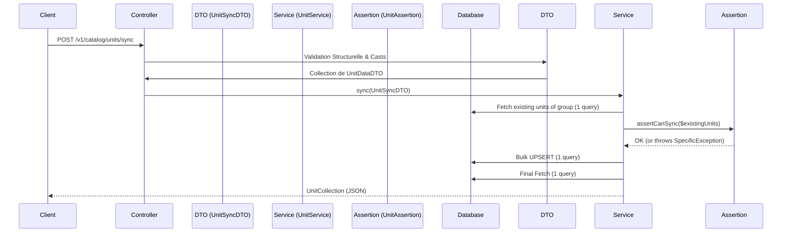

# Feature Showcase: Unit Synchronization (Bulk & Sync)

Ce document détaille l'implémentation de la gestion des unités dans le module `catalog`. C'est une fonctionnalité avancée qui démontre comment gérer des synchronisations de données complexes de manière performante (Bulk operations) et sécurisée (Business assertions).

## 1. Architecture du Flux "Sync"

Contrairement à un CRUD classique, les unités sont gérées par **groupes** (ex: Masse, Volume) via un endpoint unique de synchronisation.



## 2. Les Composants Clés

### A. La Route et le Controller
- **Route :** `POST /v1/catalog/units/sync`
- **Controller :** `UnitController@sync`
  - Utilise le `UnitPolicy@sync` pour vérifier les permissions `units.create` ou `units.update`.
  - Délègue immédiatement au service.

### B. DTOs et Validation Collective
Nous utilisons deux DTOs pour une structure typée :
- **`UnitSyncDTO`** : Reçoit le `unit_group` et une collection de `units`.
- **`UnitDataDTO`** : Représente une unité individuelle (ID, nom, ratio, etc.).

**Optimisation :** 
Le DTO utilise une règle personnalisée `BulkExists` (`app-modules/shared/src/Rules/BulkExists.php`). Au lieu de vérifier chaque ID un par un, elle valide l'existence de tous les IDs envoyés en **une seule requête SQL** `WHERE IN`.

### C. Assertions Métier (`UnitAssertion`)
Les règles métier ne sont pas dans le contrôleur, mais isolées dans des assertions documentées :
- **Limite d'activité :** Un groupe ne peut pas avoir plus de **10 unités actives** simultanément (`UnitActiveLimitException`).
- **Unicité du Ratio :** Un seul ratio de chaque valeur par groupe (`UnitRatioConflictException`).
- **Unicité de la Base :** Forcer exactement une unité avec `ratio = 1` lors de la création (`UnitBaseRequiredException`).
- **Immuabilité :** Interdiction de modifier le `ratio` ou le `code` d'une unité existante pour préserver l'historique (`UnitRatioImmutableException`).
- **Protection Système :** Impossible de modifier les unités `is_builtin` (`UnitBuiltInUpdateException`).

### D. Optimisation de la Persistance (`UnitService`)
Le service est conçu pour être "Database Friendly" :
- **Un seul SELECT** pour charger tout le groupe en mémoire au début.
- **Bulk UPSERT** : Utilisation de `Unit::upsert()`. Cela permet d'insérer les nouvelles unités et de mettre à jour les existantes en **une seule requête SQL atomique**.
- **Calculs en mémoire** : Les comparaisons pour les assertions se font sur la collection chargée, évitant des requêtes N+1.

## 3. Exceptions Spécifiques
Chaque erreur métier possède sa propre classe d'exception dans `Lahatre\Catalog\Exceptions` et son message traduit dans `resources/lang/en/exceptions.php`, permettant un retour API clair et précis.

## 4. Tests Automatisés (Pest)
La fonctionnalité est couverte par une suite de tests Pest (`app-modules/catalog/tests/Feature/UnitSyncTest.php`) qui valide :
- La création réussie d'un groupe.
- L'échec si le ratio 1 est manquant.
- Le blocage des doublons de ratio.
- La protection des unités de base (interdiction de désactivation).
- Le respect de la limite des 10 unités actives.

## 5. Exemple de Payload
```json
{
    "unit_group": "Mass",
    "units": [
        { "id": "uuid-existant", "name": "Gramme (Modified)", "is_active": true },
        { "name": "Milligramme", "symbol": "mg", "ratio": 1000, "is_active": true }
    ]
}
```
