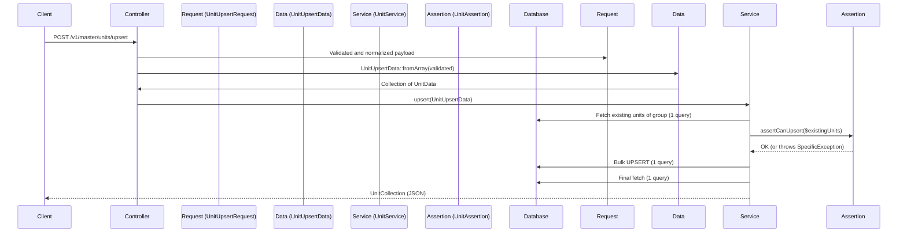

# Feature Showcase: Unit Upsert (Bulk and Upsert)

This document describes unit management in the `master` module. It demonstrates
how to handle complex data upserts efficiently through bulk operations and
safely through business assertions.

## 1. Upsert flow architecture

Unlike a classic CRUD operation, units are managed by **groups** such as Mass
and Volume through one upsert endpoint. Items absent from the payload are not
deleted.



## 2. Key components

### A. Route and controller

- **Route:** `POST /v1/master/units/upsert`
- **Controller:** `UnitController@upsert`
  - Uses `UnitPolicy@upsert` to check `units.create` or `units.update`.
  - Delegates immediately to the service.

### B. Form Request and typed Data classes

HTTP validation and transport to the service are separate:

- **`UnitUpsertRequest`:** Validates the complete structure, including
  `units.*`, and preserves indexed error paths.
- **`UnitUpsertData`:** Builds the service's typed contract through
  `::fromArray()`.
- **`UnitData`:** Represents one unit with its ID, name, symbol, and ratio.

**Optimization:** The Form Request performs collection-level validation in one
SQL query when possible instead of triggering validation or a query for every
nested item.

### C. Business assertions (`UnitAssertion`)

Business rules do not live in the controller; they are isolated in documented
assertions:

- **Activity limit:** A group may not have more than **10 active units** at
  once (`UnitActiveLimitException`).
- **Ratio uniqueness:** A group may have only one unit for each ratio value
  (`UnitRatioConflictException`).
- **Base uniqueness:** Creation must contain exactly one unit with `ratio = 1`
  (`UnitBaseRequiredException`).
- **Immutability:** The `ratio` and `code` of an existing unit cannot change,
  preserving history (`UnitRatioImmutableException`).
- **System protection:** Units with `is_builtin` cannot be modified
  (`UnitBuiltInUpdateException`).

### D. Persistence optimization (`UnitService`)

The service is designed to be database-friendly:

- One `SELECT` loads the entire group into memory at the start.
- **Bulk UPSERT:** `Unit::upsert()` inserts new units and updates existing ones
  in one atomic SQL query.
- **In-memory calculations:** Assertion comparisons use the loaded collection,
  avoiding N+1 queries.

## 3. Specific exceptions

Each business error has its own exception class in
`Lahatre\Catalog\Exceptions` and a translated message in
`resources/lang/en/exceptions.php`, providing a clear API response.

## 4. Automated tests (Pest)

The feature is covered by Pest tests in
`app-modules/master/tests/Feature/UnitServiceTest.php`, including:

- Successful group creation.
- Failure when ratio 1 is missing.
- Duplicate-ratio rejection.
- Protection of base units, including deactivation prevention.
- Enforcement of the ten-active-unit limit.

## 5. Payload example

```json
{
    "unit_group": "Mass",
    "units": [
        { "id": "existing-uuid", "name": "Gram (Modified)", "is_active": true },
        { "name": "Milligram", "symbol": "mg", "ratio": 1000, "is_active": true }
    ]
}
```
